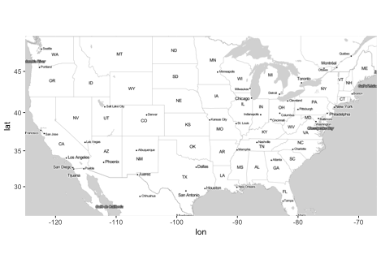
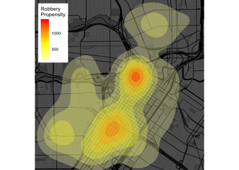
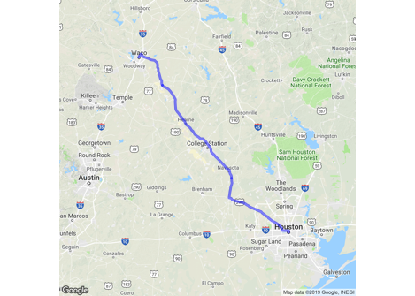

<!-- README.md is generated from README.Rmd. Please edit that file -->

### *Attention!*

Google has [recently changed its API
requirements](https://developers.google.com/maps/documentation/geocoding/usage-and-billing),
and **ggmap** users are now required to register with Google. From a
user’s perspective, there are essentially three ramifications of this:
1. Users must register with Google. You can do this at
\[<a href="https://cloud.google.com/maps-platform/" class="uri">https://cloud.google.com/maps-platform/</a>\].
While it will require a valid credit card (sorry!), there seems to be a
fair bit of free use before you incur charges, and even then the charges
are modest for light use. 2. Users must enable the APIs they intend to
use. What may appear to **ggmap** users as one overarching “Google Maps”
product, Google in fact has several services that it provides as
geo-related solutions. For example, the [Maps Static
API](https://developers.google.com/maps/documentation/maps-static/intro)
provides map images, while the [Geocoding
API](https://developers.google.com/maps/documentation/geocoding/intro)
provides geocoding and reverse geocoding services. Apart from the
relevant Terms of Service, generally **ggmap** users don’t need to think
about the different services. For example, you just need to remember
that `get_googlemap()` gets maps, `geocode()` geocodes (with Google, DSK
is done), etc., and **ggmap** handles the queries for you. *However*,
you do need to enable the APIs before you use them. You’ll only need to
do that once, and then they’ll be ready for you to use. 3. Inside R,
after loading **ggmap**, you’ll need provide **ggmap** with your API
key, a hash value that authenticates you to Google’s servers. You’ll
need to load that once per session. Your API key is *private* and unique
to you, so be careful not to share it online, for example in a GitHub
issue or saving it in a shared R script file. This is made a bit easier
by **ggmap** scrubbing the key out of queries by default. (Read the
details section of the `register_google()` documentation for a bit more
info on this point.) Once you’ve done 1. and 2. above, all you’ll need
to do is load **ggmap** with `library("ggmap")` and then register your
key (if you’re using a Google service, which you probably are) with
`register_google(key = "your-key")`.

We hope the new version of **ggmap** will be on CRAN soon, but until
then you can install the version here with:

``` r
if(!requireNamespace("devtools")) install.packages("devtools")
devtools::install_github("dkahle/ggmap")
```

The details of the readme below will be changed shortly to reflect these
changes. Thanks for your patience!

<hr>

ggmap
=====

**ggmap** is an R package that makes it easy to retrieve raster map
tiles from popular online mapping services like [Google
Maps](https://developers.google.com/maps/documentation/static-maps/?hl=en),
[OpenStreetMap](https://www.openstreetmap.org) and [Stamen
Maps](http://maps.stamen.com) and plot them using the
[**ggplot2**](https://github.com/tidyverse/ggplot2) framework:

``` r
library("ggmap")

us <- c(left = -125, bottom = 25.75, right = -67, top = 49)
map <- get_stamenmap(us, zoom = 5, maptype = "toner-lite")
ggmap(map)
```



``` r
ggmap(map, extent = "device")
```


Use `qmplot()` in the same way you’d use `qplot()`, but with a map
automatically added in the background:

``` r
library("dplyr")
library("forcats")

# define helper
`%notin%` <- function(lhs, rhs) !(lhs %in% rhs)

# reduce crime to violent crimes in downtown houston
violent_crimes <- crime %>% 
  filter(
    offense %notin% c("auto theft", "theft", "burglary"),
    -95.39681 <= lon & lon <= -95.34188,
     29.73631 <= lat & lat <=  29.78400
  ) %>% 
  mutate(
    offense = fct_drop(offense),
    offense = fct_relevel(offense, 
      c("robbery", "aggravated assault", "rape", "murder")
    )
  )

# use qmplot to make a scatterplot on a map
qmplot(lon, lat, data = violent_crimes, maptype = "toner-lite", color = I("red"))
```


All the **ggplot2** geom’s are available. For example, you can make a
contour plot with `geom = "density2d"`:

``` r
qmplot(lon, lat, data = violent_crimes, maptype = "toner-lite", geom = "density2d", color = I("red"))
#  Using zoom = 14...
```


In fact, since **ggmap**’s built on top of **ggplot2**, all your usual
**ggplot2** stuff (geoms, polishing, etc.) will work, and there are some
unique graphing perks **ggmap** brings to the table, too.

``` r
robberies <- violent_crimes %>% filter(offense == "robbery")

qmplot(lon, lat, data = violent_crimes, geom = "blank", 
  zoom = 15, maptype = "toner-background", darken = .7, legend = "topleft"
) +
  stat_density_2d(aes(fill = ..level..), geom = "polygon", alpha = .3, color = NA) +
  scale_fill_gradient2("Robbery\nPropensity", low = "white", mid = "yellow", high = "red", midpoint = 650)
```



Faceting works, too:

``` r
qmplot(lon, lat, data = violent_crimes, maptype = "toner-background", color = offense) + 
  facet_wrap(~ offense)
```


For convenience, here are a few maps of Europe:

``` r
europe <- c(left = -12, bottom = 35, right = 30, top = 63)
get_stamenmap(europe, zoom = 5) %>% ggmap()
```


``` r
get_stamenmap(europe, zoom = 5, maptype = "toner-lite") %>% ggmap()
```


Google Maps and Credentials
---------------------------

[Google Maps](http://developers.google.com/maps/terms) can be used just
as easily. However, since Google Maps use a center/zoom specification,
their input is a bit different:

``` r
get_googlemap("waco texas", zoom = 12) %>% ggmap()
#  Source : https://maps.googleapis.com/maps/api/staticmap?center=waco+texas&zoom=12&size=640x640&scale=2&maptype=terrain
#  Source : https://maps.googleapis.com/maps/api/geocode/json?address=waco%20texas
```


Moreover, you can get various different styles of Google Maps with
**ggmap** (just like Stamen Maps):

``` r
get_googlemap("waco texas", zoom = 12, maptype = "satellite") %>% ggmap()
#  Source : https://maps.googleapis.com/maps/api/staticmap?center=waco+texas&zoom=12&size=640x640&scale=2&maptype=satellite
#  Source : https://maps.googleapis.com/maps/api/geocode/json?address=waco%20texas
```


``` r
get_googlemap("waco texas", zoom = 12, maptype = "roadmap") %>% ggmap()
#  Source : https://maps.googleapis.com/maps/api/staticmap?center=waco+texas&zoom=12&size=640x640&scale=2&maptype=roadmap
#  Source : https://maps.googleapis.com/maps/api/geocode/json?address=waco%20texas
```


``` r
get_googlemap("waco texas", zoom = 12, maptype = "hybrid") %>% ggmap()
#  Source : https://maps.googleapis.com/maps/api/staticmap?center=waco+texas&zoom=12&size=640x640&scale=2&maptype=hybrid
#  Source : https://maps.googleapis.com/maps/api/geocode/json?address=waco%20texas
```


Google’s geocoding and reverse geocoding API’s are available through
`geocode()` and `revgeocode()`, respectively:

``` r
geocode("1301 S University Parks Dr, Waco, TX 76798")
#  Source : https://maps.googleapis.com/maps/api/geocode/json?address=1301%20S%20University%20Parks%20Dr%2C%20Waco%2C%20TX%2076798
#         lon      lat
#  1 -97.1161 31.55099
revgeocode(c(lon = -97.1161, lat = 31.55098))
#  Information from URL : https://maps.googleapis.com/maps/api/geocode/json?latlng=31.55098,-97.1161
#  [1] "1301 S University Parks Dr, Waco, TX 76706, USA"
```

There is also a `mutate_geocode()` that works similarly to
[**dplyr**](https://github.com/hadley/dplyr)’s `mutate()` function:

``` r
df <- data.frame(
  address = c("1600 Pennsylvania Avenue, Washington DC", "", "waco texas"),
  stringsAsFactors = FALSE
)
df %>% mutate_geocode(address)
#  Source : https://maps.googleapis.com/maps/api/geocode/json?address=1600%20Pennsylvania%20Avenue%2C%20Washington%20DC
#  Source : https://maps.googleapis.com/maps/api/geocode/json?address=waco%20texas
#                                    address       lon      lat
#  1 1600 Pennsylvania Avenue, Washington DC -77.03657 38.89766
#  2                                                NA       NA
#  3                              waco texas -97.14667 31.54933
```

Treks use Google’s routing API to give you routes (`route()` and
`trek()` give slightly different results; the latter hugs roads):

``` r
trek_df <- trek("houson, texas", "waco, texas", structure = "route")
#  Source : https://maps.googleapis.com/maps/api/directions/json?origin=houson%2C%20texas&destination=waco%2C%20texas&mode=driving&units=metric&alternatives=false
qmap("college station, texas", zoom = 8) +
  geom_path(
    aes(x = lon, y = lat),  colour = "blue",
    size = 1.5, alpha = .5,
    data = trek_df, lineend = "round"
  )
#  Source : https://maps.googleapis.com/maps/api/staticmap?center=college+station,+texas&zoom=8&size=640x640&scale=2&maptype=terrain&language=en-EN
#  Source : https://maps.googleapis.com/maps/api/geocode/json?address=college%20station%2C%20texas
```



(They also provide information on how long it takes to get from point A
to point B.)

Map distances, in both length and anticipated time, can be computed with
`mapdist()`). Moreover the function is vectorized:

``` r
mapdist(c("houston, texas", "dallas"), "waco, texas")
#  Source : https://maps.googleapis.com/maps/api/distancematrix/json?origins=dallas&destinations=waco%2C%20texas&mode=driving&language=en-EN
#  Source : https://maps.googleapis.com/maps/api/distancematrix/json?origins=houston%2C%20texas&destinations=waco%2C%20texas&mode=driving&language=en-EN
#              from          to      m      km     miles seconds   minutes
#  1 houston, texas waco, texas 299319 299.319 185.99683   10539 175.65000
#  2         dallas waco, texas 152481 152.481  94.75169    5360  89.33333
#       hours
#  1 2.927500
#  2 1.488889
```

### Google credentialing

If you have a Google API key, you can exceed the standard limits Google
places on queries. By default, when **ggmap** is loaded it will set the
following credentials and limits:

``` r
ggmap_credentials()
#  Google - 
#     key :  
#     account_type : standard 
#     day_limit : 2500 
#     second_limit : 50 
#     client :  
#     signature :
```

Look at the documentation of `?register_google()` to learn more. If you
do have an API key, you set it with:

``` r
register_google(key = "[your key here]", account_type = "premium", day_limit = 100000)
ggmap_credentials()
#  Google - 
#     key : [your key here] 
#     account_type : premium 
#     day_limit : 1e+05 
#     second_limit : 50 
#     client :  
#     signature :
```

These will then be used and checked when creating the query URL:

``` r
register_google(key = "AbCdEfGhIjKlMnOpQrStUvWxYz")
get_googlemap("waco texas", urlonly = TRUE)
#  [1] "https://maps.googleapis.com/maps/api/staticmap?center=waco+texas&zoom=10&size=640x640&scale=2&maptype=terrain&key=AbCdEfGhIjKlMnOpQrStUvWxYz"
```

For anything that hasn’t been implemente (URL-wise), you can inject code
into the query usin g `inject`:

``` r
get_googlemap("waco texas", urlonly = TRUE, inject = "otherItem = Stuff")
#  [1] "https://maps.googleapis.com/maps/api/staticmap?center=waco+texas&zoom=10&size=640x640&scale=2&maptype=terrain&key=AbCdEfGhIjKlMnOpQrStUvWxYz&otherItem%20=%20Stuff"
```

Installation
------------

-   From CRAN: `install.packages("ggmap")`

-   From Github: `devtools::install_github("dkahle/ggmap")`
