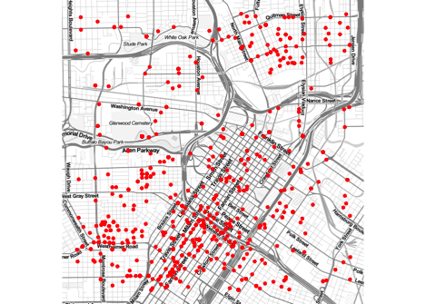
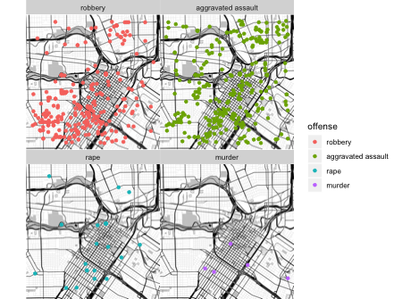
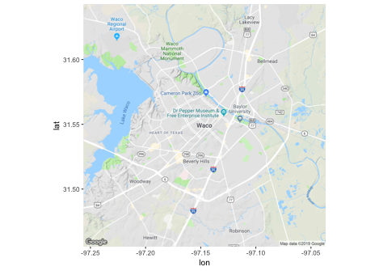

<!-- README.md is generated from README.Rmd. Please edit that file -->

### *Attention!*

Google has [recently changed its API
requirements](https://developers.google.com/maps/documentation/geocoding/usage-and-billing),
and **ggmap** users are now required to register with Google. From a
user’s perspective, there are essentially three ramifications of this:

1.  Users must register with Google. You can do this at
    <a href="https://cloud.google.com/maps-platform/" class="uri">https://cloud.google.com/maps-platform/</a>.
    While it will require a valid credit card (sorry!), there seems to
    be a fair bit of free use before you incur charges, and even then
    the charges are modest for light use.

2.  Users must enable the APIs they intend to use. What may appear to
    **ggmap** users as one overarching “Google Maps” product, Google in
    fact has several services that it provides as geo-related solutions.
    For example, the [Maps Static
    API](https://developers.google.com/maps/documentation/maps-static/intro)
    provides map images, while the [Geocoding
    API](https://developers.google.com/maps/documentation/geocoding/intro)
    provides geocoding and reverse geocoding services. Apart from the
    relevant Terms of Service, generally **ggmap** users don’t need to
    think about the different services. For example, you just need to
    remember that `get_googlemap()` gets maps, `geocode()` geocodes
    (with Google, DSK is done), etc., and **ggmap** handles the queries
    for you. *However*, you do need to enable the APIs before you use
    them. You’ll only need to do that once, and then they’ll be ready
    for you to use. Enabling the APIs just means clicking a few radio
    buttons on the Google Maps Platform web interface listed above, so
    it’s easy.

3.  Inside R, after loading the new version of **ggmap**, you’ll need
    provide **ggmap** with your API key, a [hash
    value](https://en.wikipedia.org/wiki/Hash_function) (think string of
    jibberish) that authenticates you to Google’s servers. This can be
    done on a temporary basis with `register_google(key = "[your key]")`
    or permanently using
    `register_google(key = "[your key]", write = TRUE)` (note: this will
    overwrite your `~/.Renviron` file by replacing/adding the relevant
    line). If you use the former, know that you’ll need to re-do it
    every time you reset R.

Your API key is *private* and unique to you, so be careful not to share
it online, for example in a GitHub issue or saving it in a shared R
script file. If you share it inadvertantly, just get on Google’s website
and regenerate your key - this will retire the old one. Keeping your key
private is made a bit easier by **ggmap** scrubbing the key out of
queries by default, so when URLs are shown in your console, they’ll look
something like `key=xxx`. (Read the details section of the
`register_google()` documentation for a bit more info on this point.)

We hope the new version of **ggmap** will be on CRAN soon, but until
then you can install the version here with:

``` r
if(!requireNamespace("devtools")) install.packages("devtools")
devtools::install_github("dkahle/ggmap")
```

The details of the readme below will be changed shortly to reflect these
changes. Thanks for your patience!

<hr>

ggmap
=====

**ggmap** is an R package that makes it easy to retrieve raster map
tiles from popular online mapping services like [Google
Maps](https://developers.google.com/maps/documentation/static-maps/?hl=en)
and [Stamen Maps](http://maps.stamen.com) and plot them using the
[**ggplot2**](https://github.com/tidyverse/ggplot2) framework:

``` r
library("ggmap")

us <- c(left = -125, bottom = 25.75, right = -67, top = 49)
get_stamenmap(us, zoom = 5, maptype = "toner-lite") %>% ggmap() 
```


Use `qmplot()` in the same way you’d use `qplot()`, but with a map
automatically added in the background:

``` r
library("dplyr")
library("forcats")

# define helper
`%notin%` <- function(lhs, rhs) !(lhs %in% rhs)

# reduce crime to violent crimes in downtown houston
violent_crimes <- crime %>% 
  filter(
    offense %notin% c("auto theft", "theft", "burglary"),
    -95.39681 <= lon & lon <= -95.34188,
     29.73631 <= lat & lat <=  29.78400
  ) %>% 
  mutate(
    offense = fct_drop(offense),
    offense = fct_relevel(offense, c("robbery", "aggravated assault", "rape", "murder"))
  )

# use qmplot to make a scatterplot on a map
qmplot(lon, lat, data = violent_crimes, maptype = "toner-lite", color = I("red"))
```



All the **ggplot2** geom’s are available. For example, you can make a
contour plot with `geom = "density2d"`:

``` r
qmplot(lon, lat, data = violent_crimes, maptype = "toner-lite", geom = "density2d", color = I("red"))
```

In fact, since **ggmap**’s built on top of **ggplot2**, all your usual
**ggplot2** stuff (geoms, polishing, etc.) will work, and there are some
unique graphing perks **ggmap** brings to the table, too.

``` r
robberies <- violent_crimes %>% filter(offense == "robbery")

qmplot(lon, lat, data = violent_crimes, geom = "blank", 
  zoom = 14, maptype = "toner-background", darken = .7, legend = "topleft"
) +
  stat_density_2d(aes(fill = ..level..), geom = "polygon", alpha = .3, color = NA) +
  scale_fill_gradient2("Robbery\nPropensity", low = "white", mid = "yellow", high = "red", midpoint = 650)
```


Faceting works, too:

``` r
qmplot(lon, lat, data = violent_crimes, maptype = "toner-background", color = offense) + 
  facet_wrap(~ offense)
```



Google Maps and Credentials
---------------------------

[Google Maps](http://developers.google.com/maps/terms) can be used just
as easily. However, since Google Maps use a center/zoom specification,
their input is a bit different:

``` r
get_googlemap("waco texas", zoom = 12) %>% ggmap()
#  Source : https://maps.googleapis.com/maps/api/staticmap?center=waco%20texas&zoom=12&size=640x640&scale=2&maptype=terrain&key=xxx
#  Source : https://maps.googleapis.com/maps/api/geocode/json?address=waco+texas&key=xxx
```



Moreover, you can get various different styles of Google Maps with
**ggmap** (just like Stamen Maps):

``` r
get_googlemap("waco texas", zoom = 12, maptype = "satellite") %>% ggmap()
get_googlemap("waco texas", zoom = 12, maptype = "hybrid") %>% ggmap()
get_googlemap("waco texas", zoom = 12, maptype = "roadmap") %>% ggmap()
```

Google’s geocoding and reverse geocoding API’s are available through
`geocode()` and `revgeocode()`, respectively:

``` r
geocode("1301 S University Parks Dr, Waco, TX 76798")
#  Source : https://maps.googleapis.com/maps/api/geocode/json?address=1301+S+University+Parks+Dr,+Waco,+TX+76798&key=xxx
#  # A tibble: 1 x 2
#      lon   lat
#    <dbl> <dbl>
#  1 -97.1  31.6
revgeocode(c(lon = -97.1161, lat = 31.55098))
#  Source : https://maps.googleapis.com/maps/api/geocode/json?latlng=31.55098,-97.1161&key=xxx
#  Multiple addresses found, the first will be returned:
#    1301 S University Parks Dr, Waco, TX 76706, USA
#    55 Baylor Ave, Waco, TX 76706, USA
#    1437 FM434, Waco, TX 76706, USA
#    Bear Trail, Waco, TX 76706, USA
#    Robinson, TX 76706, USA
#    Waco, TX, USA
#    McLennan County, TX, USA
#    United States
#  [1] "1301 S University Parks Dr, Waco, TX 76706, USA"
```

There is also a `mutate_geocode()` that works similarly to
[**dplyr**](https://github.com/hadley/dplyr)’s `mutate()` function:

``` r
tibble(address = c("white house", "", "waco texas")) %>% 
  mutate_geocode(address)
#  Source : https://maps.googleapis.com/maps/api/geocode/json?address=white+house&key=xxx
#  Source : https://maps.googleapis.com/maps/api/geocode/json?address=waco+texas&key=xxx
#  # A tibble: 3 x 3
#    address       lon   lat
#    <chr>       <dbl> <dbl>
#  1 white house -77.0  38.9
#  2 ""           NA    NA  
#  3 waco texas  -97.1  31.5
```

Treks use Google’s routing API to give you routes (`route()` and
`trek()` give slightly different results; the latter hugs roads):

``` r
trek_df <- trek("houson, texas", "waco, texas", structure = "route")
#  Source : https://maps.googleapis.com/maps/api/directions/json?origin=houson,+texas&destination=waco,+texas&key=xxx&mode=driving&alternatives=false&units=metric
qmap("college station, texas", zoom = 8) +
  geom_path(
    aes(x = lon, y = lat),  colour = "blue",
    size = 1.5, alpha = .5,
    data = trek_df, lineend = "round"
  )
#  Source : https://maps.googleapis.com/maps/api/staticmap?center=college%20station,%20texas&zoom=8&size=640x640&scale=2&maptype=terrain&language=en-EN&key=xxx
#  Source : https://maps.googleapis.com/maps/api/geocode/json?address=college+station,+texas&key=xxx
```


(They also provide information on how long it takes to get from point A
to point B.)

Map distances, in both length and anticipated time, can be computed with
`mapdist()`). Moreover the function is vectorized:

``` r
mapdist(c("houston, texas", "dallas"), "waco, texas")
#  Source : https://maps.googleapis.com/maps/api/distancematrix/json?origins=dallas&destinations=waco,+texas&key=xxx&mode=driving
#  Source : https://maps.googleapis.com/maps/api/distancematrix/json?origins=houston,+texas&destinations=waco,+texas&key=xxx&mode=driving
#  # A tibble: 2 x 9
#    from          to               m    km miles seconds minutes hours mode  
#    <chr>         <chr>        <int> <dbl> <dbl>   <int>   <dbl> <dbl> <chr> 
#  1 houston, tex… waco, texas 298570  299. 186.    10297   172.   2.86 drivi…
#  2 dallas        waco, texas 152822  153.  95.0    5394    89.9  1.50 drivi…
```

Installation
------------

-   From CRAN: `install.packages("ggmap")`

-   From Github: `devtools::install_github("dkahle/ggmap")`
