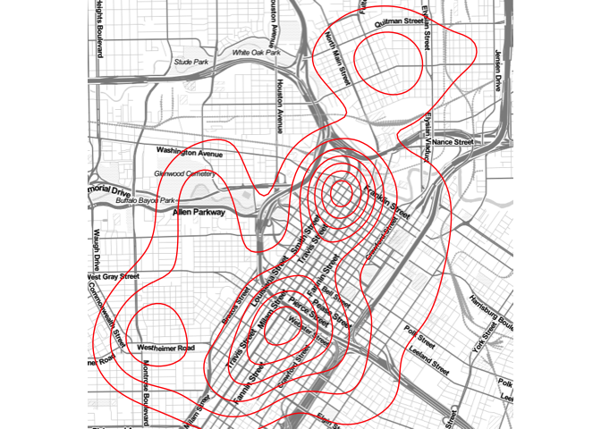

<!-- README.md is generated from README.Rmd. Please edit that file -->
ggmap
=====

**ggmap** makes it easy to retrieve raster map tiles from popular online mapping services like [Google Maps](https://developers.google.com/maps/documentation/static-maps/?hl=en), [OpenStreetMap](https://www.openstreetmap.org), [Stamen Maps](http://maps.stamen.com), and plot them using the **ggplot2** framework:

``` r
library(ggmap)

us <- c(left = -125, bottom = 25.75, right = -67, top = 49)
map <- get_stamenmap(us, zoom = 5, maptype = "toner-lite")
ggmap(map)
```


``` r
ggmap(map, extent = "device")
```


Use `qmplot()` in the same way you'd use `qplot()`, but with a map automatically added in the background:

``` r
library(dplyr)

# only violent crimes
violent_crimes <- filter(crime, 
  offense != "auto theft", offense != "theft", offense != "burglary"
)

# rank violent crimes
violent_crimes$offense <- factor(
  violent_crimes$offense,
  levels = c("robbery", "aggravated assault", "rape", "murder")
)

# restrict to downtown
violent_crimes <- filter(violent_crimes,
  -95.39681 <= lon & lon <= -95.34188,
   29.73631 <= lat & lat <=  29.78400
)

qmplot(lon, lat, data = violent_crimes, maptype = "toner-lite", color = I("red"))
```


``` r
qmplot(lon, lat, data = violent_crimes, maptype = "toner-lite", geom = "density2d", color = I("red"))
```



Since **ggmap**'s built on top of **ggplot2**, all your usual **ggplot2** stuff (geoms, polishing, etc.) will work, and there are some unique graphing perks **ggmap** brings to the table, too.

``` r
robberies <- violent_crimes %>% filter(offense == "robbery")

qmplot(lon, lat, data = violent_crimes, geom = "blank", zoom = 15, maptype = "toner-background", darken = .7, legend = "topleft") +
  stat_density_2d(aes(fill = ..level..), geom = "polygon", alpha = .3, color = NA) +
  scale_fill_gradient2("Robbery\nPropensity", low = "white", mid = "yellow", high = "red", midpoint = 650)
```


Faceting works, too:

``` r
qmplot(lon, lat, data = violent_crimes, maptype = "toner-background", color = offense) + 
  facet_wrap(~ offense)
```


For convenience, here's a map of Europe:

``` r
europe <- c(left = -12, bottom = 35, right = 30, top = 63)
get_stamenmap(europe, zoom = 5) %>% ggmap()
```


``` r
get_stamenmap(europe, zoom = 5, maptype = "toner-lite") %>% ggmap()
```


Installation
------------

-   From CRAN: `install.packages("ggmap")`

-   From Github: `devtools::install_github("dkahle/ggmap")`
